<!-- .slide: data-background="assets/backdrop.webp" class="dark no-logo" -->

# Introduction to amplicon sequencing data analysis

Christian Diener 
D&RI of Hygiene, Microbiology and Environmental Medicine

  

<a href="https://creativecommons.org/licenses/by-sa/4.0/"><i class="fa-solid fa-camera-retro"></i>CC BY-SA 4.0</a>
<a href="https://dienerlab.com"><i class="fa-solid fa-house-signal"></i></i>dienerlab.com</a>
<a href="https://github.com/dienerlab"><i class="fa-brands fa-github"></i>dienerlab</a>
<a href="https://bsky.app/profile/cdiener.com"><i class="fa-brands fa-bluesky"></i></i>cdiener.com</a>

---

## Guts, Camera, Action :movie_camera:

📕 Let's switch to the notebook and get started

---

<!-- .slide: data-background="var(--primary)" class="dark" -->

# QIIME

Pronounced like *chime* 🔔

Created ~2010 during the Human Microbiome Project (2007 - 2016) under the leadership
of Greg Caporaso and Rob Knight. Currently maintained by the Caporaso lab.

---

## What is QIIME 2?

> QIIME 2 is a powerful, extensible, and decentralized microbiome
analysis package with a focus on data processing and analysis transparency.

*Q*uantitative *i*nsights *i*nto *M*icrobial *E*cology

---

## What can we do with QIIME 2?

Essentially, QIIME is a set of *commands* to transform microbiome *data* into
*intermediate outputs* and *visualizations*.

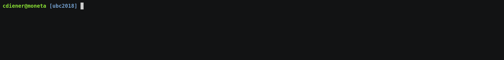

It's commonly used via the *command line*. We'll use it within the Colab Notebook

---

## Where to find help?

QIIME 2 comes with a lot of help, including a wide range of [tutorials](https://docs.qiime2.org/2023.7/tutorials/),
[general documentation](https://docs.qiime2.org/2023.7/) and a
[user forum](https://forum.qiime2.org/) where you can ask questions.

---

## Artifacts, actions and visualizations

QIIME 2 manages *artifacts*, which are basically intermediate data that feed
into *actions* to either produce other artifacts or *visualizations*.

https://docs.qiime2.org/2023.7/tutorials/overview/

---

## Remember

Artifacts often represent *intermediate steps*, but Visualizations are *end points*
meant for human consumption :point_up:.

Visualizations *cannot* be used as inputs for additional commands

---

## What is amplicon sequencing?

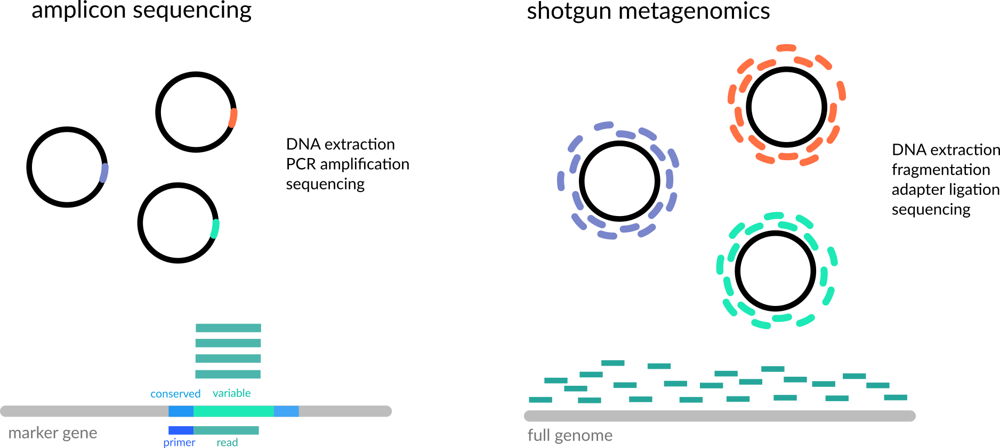

---

## Why the 16S gene?

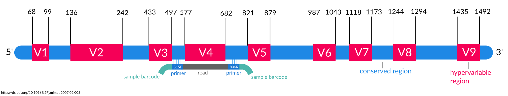

The 16S gene is *universal* and contains interspersed conserved regions perfect for *PCR* priming and hypervariable regions with *phylogenetic heterogeneity*.

---

## Short read sequencing

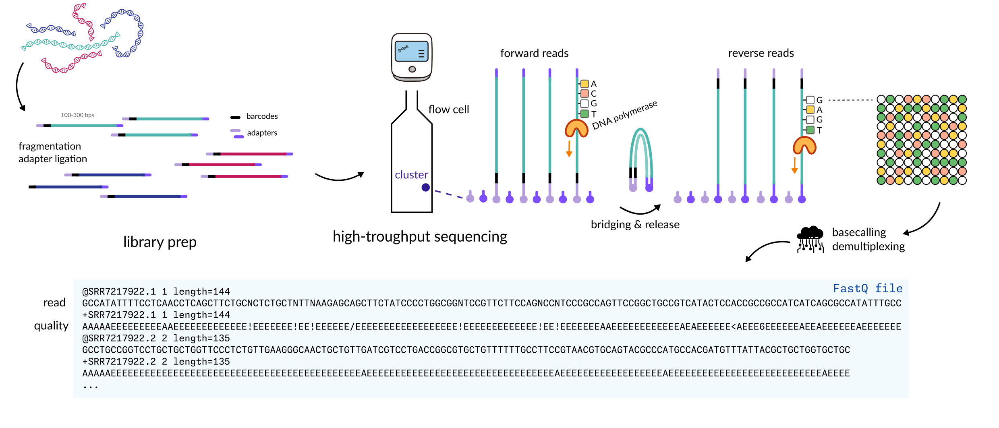

---

## What will we do today?

---

## Artifact Hunting

To start, we'll import our raw data into QIIME as an *artifact*.

:computer: Let's switch to the notebook and get started

---

## Preprocessing sequencing reads

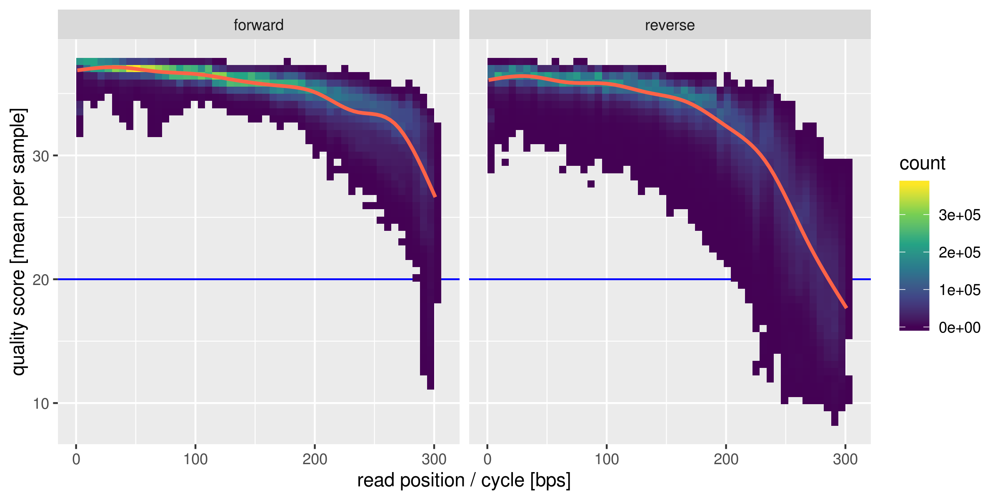

1. trim low quality regions
2. remove reads with low average quality
3. remove reads with ambiguous bases (Ns)
4. remove PhiX (added to sequencing)

---

## Careful with trimming!

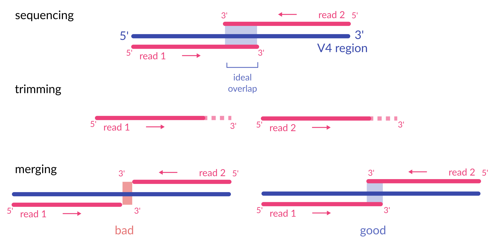

Most common reason for losing most of the reads in the Qiime2 DADA2 pipeline.

The primers used in this study were F515/R806. How long is the amplified fragment?

---

## Denoising with DADA 2

We just ran the DADA2 plugin for QIIME, which is doing 4 things:

1. filter and trim the reads
2. find the most likely original sequences in the sample (ASVs)
3. remove chimeras
4. merge forward and reverse ASVs
5. count the abundances

---

## Identifying amplicon sequence variants (ASVs)

Expectation-Maximization (EM) algorithm to find amplicon sequence variants
(ASVs) and the real error model at the same time.

New ASVs are formed based on probability under a Poisson count model.

----

## Hands-on DADA2

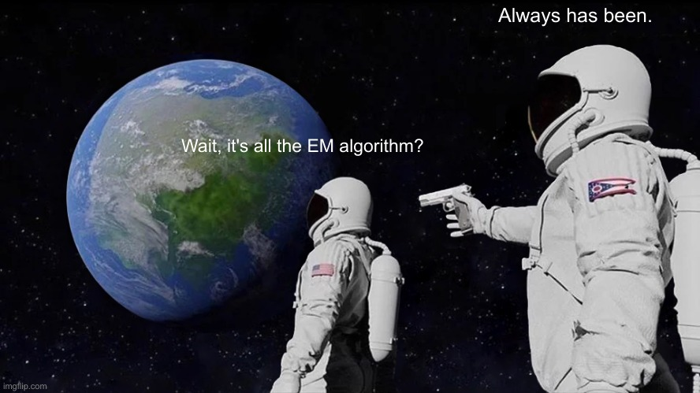

---

## PCR chimeras

Very common in amplicon sequencing. Can you guess why?

---

We now have a table containing the counts for each ASV in each sample.
We also have a list of ASVs.

 

:thinking_face: Do you have an idea for what we could do with those two data sets? What quantities
might we be interested in?

---

<!-- .slide: data-background="var(--primary)" class="dark" -->

## Diversity metrics

In microbial community analysis we are usually interested in two different families of diversity metrics,
*alpha diversity* (ecological diversity within a sample) and *beta diversity* (ecological differences between samples).

---

## Alpha diversity

How diverse is a single sample?

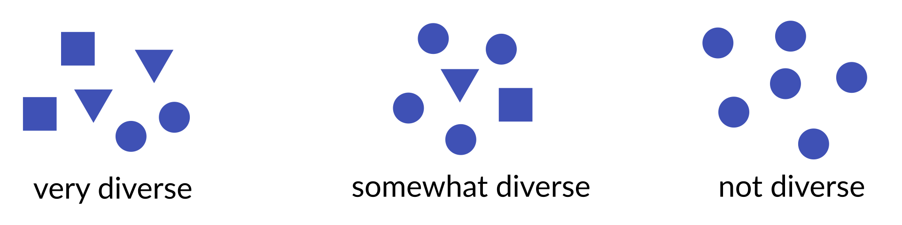

- *richness:* how many taxa do we observe (richness)? 
  → #observed taxa
- *evenness*: how evenly are abundances distributed across taxa? 
  → Evenness index
- *mixtures*: metrics that combine both richness and evenness 
  → Shannon Index, Simpson's Index

---

## Statistical tests for alpha diversity

Alpha diversity will provide a single value for each sample.

It can be treated as any other sample measurement and is suitable for classic
univariate tests (t-test, Mann-Whitney U test).

---

## Beta diversity

How different are two or more samples/donors/sites from one another other?

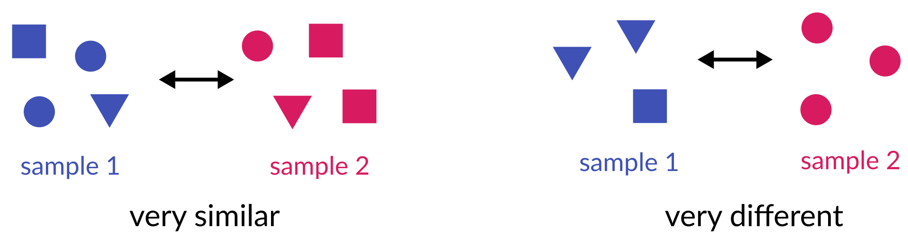

- *unweighted:* how many taxa are *shared* between samples? 
  → Jaccard index, unweighted UniFrac
- *weighted:* do shared taxa have *similar abundances*? 
  → Bray-Curtis distance, weighted UniFrac

---

### UniFrac

Do samples share *genetically similar* taxa?

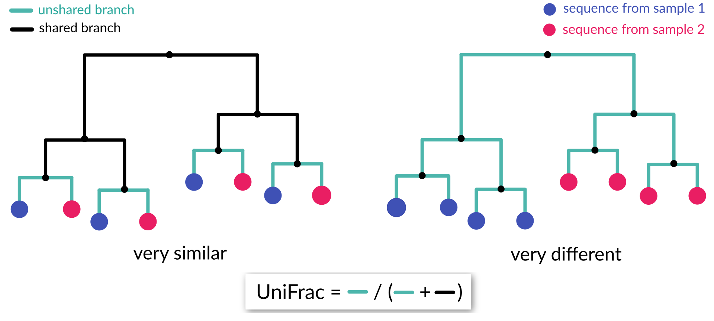

Weighted UniFrac scales branches by abundance.

---

## How to build a phylogenetic tree?

One of the basic things we might want to look at is how the sequences across
all samples are related to one another. That is, we are often interested in their *phylogeny*.

Phylogenetic trees are built from *multiple sequence alignments* and sequences are
arranged by *sequence similarity* (branch length).

---

## Principal Coordinate Analysis

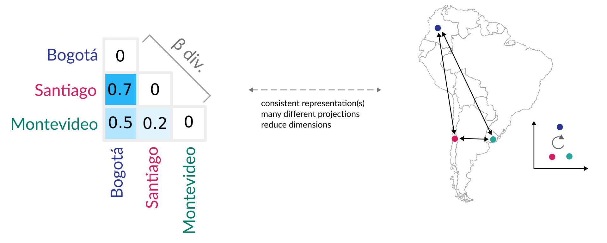

---

## Statistical tests for beta diversity

More complicated. Usually not normal and very heterogeneous. PERMANOVA can deal with that.

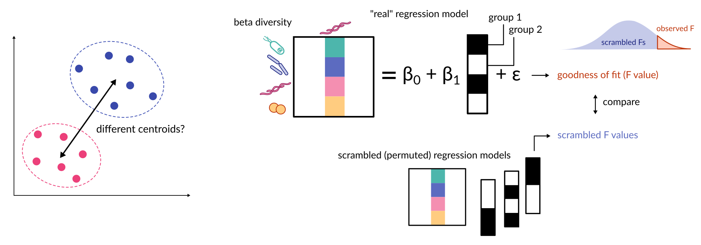

---

<!-- .slide: data-background="var(--primary)" class="dark" -->

## Run the diversity analyses

:computer: Let's switch to the notebook and calculate the diversity metrics

---

<!-- .slide: data-background="var(--primary)" class="dark" -->

## But what organisms are there in our sample?

We are still just working with sequences and have no idea what *organisms*
they correspond to.

 

:thinking_face: What would you do to go from a sequence to an organism's name?

---

## Taxonomic ranks

---

Even though directly aligning our sequences to a *database of known genes*
seems most intuitive, this does not always work well in practice. Why?

---

## Multinomial Naive Bayes

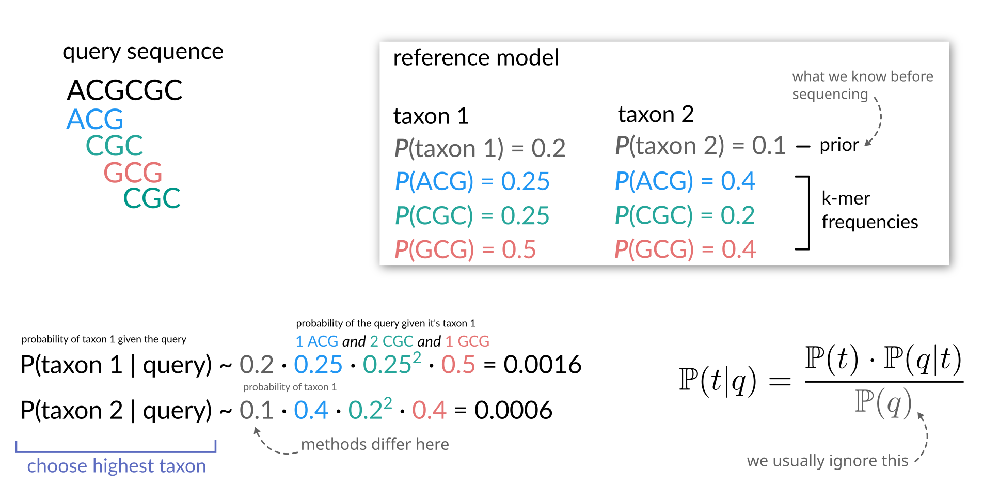

Instead, use *subsequences (k-mers)* and their counts to *predict* the
lineage/taxonomy with *machine learning* methods. For 16S amplicon fragments this
often provides better *generalization* and faster results.

---

<!-- .slide: data-background="var(--primary)" class="dark" -->

## Let's assign taxonomy to the sequences

:computer: Let's switch to the notebook and assign taxonomy to our ASVs

---

## Your turn

Which taxa are associated with the disease state?

---

<!-- .slide: data-background="assets/meduni/campus.png" class="hero no-logo" -->

# Thanks! :smile:

  

Christine Moissl-Eichinger 
Gregor Gorkiewicz 
Alexander Mahnert 
Marija Durdevic 
Christina Kumpitsch 
Angela Horvath 

**Funding** 

MOLMED PhD program

