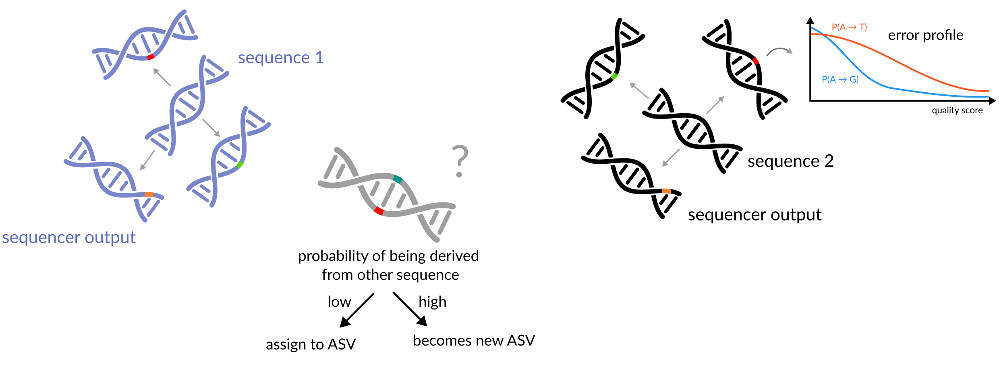

<!-- .slide: data-background="assets/backdrop.webp" class="dark no-logo" -->

# Introduction to amplicon sequencing data analysis

Christian Diener 
D&RI of Hygiene, Microbiology and Environmental Medicine

  

<a href="https://creativecommons.org/licenses/by-sa/4.0/"><i class="fa-solid fa-camera-retro"></i>CC BY-SA 4.0</a>
<a href="https://dienerlab.com"><i class="fa-solid fa-house-signal"></i></i>dienerlab.com</a>
<a href="https://github.com/dienerlab"><i class="fa-brands fa-github"></i>dienerlab</a>
<a href="https://bsky.app/profile/cdiener.com"><i class="fa-brands fa-bluesky"></i></i>cdiener.com</a>

---

## What is amplicon sequencing?

---

## Why the 16S gene?

The 16S gene is *universal* and contains interspersed conserved regions perfect for *PCR* priming and hypervariable regions with *phylogenetic heterogeneity*.

---

## Short read sequencing

---

## What will we do today?

---

<!-- .slide: data-background="var(--primary)" class="dark" -->

# QIIME

Pronounced like *chime* 🔔

Created ~2010 during the Human Microbiome Project (2007 - 2016) under the leadership
of Greg Caporaso and Rob Knight. Currently maintained by the Caporaso lab.

---

## What is QIIME 2?

> QIIME 2 is a powerful, extensible, and decentralized microbiome
analysis package with a focus on data processing and analysis transparency.

*Q*uantitative *i*nsights *i*nto *M*icrobial *E*cology

Boylen, Rideout, Dillon, Bokulich et al., Nat Biotech 2020, https://doi.org/10.1038/s41587-019-0209-9

---

## What can we do with QIIME 2?

Essentially, QIIME is a set of *commands* to transform microbiome *data* into
*intermediate outputs* and *visualizations*.

It's commonly used via the *command line*. We'll use it within Jupyter notebooks.

---

## Where to find help?

QIIME 2 comes with a lot of help, including a wide range of [tutorials](https://docs.qiime2.org/2024.10/tutorials/),
[general documentation](https://docs.qiime2.org/2024.10/) and a
[user forum](https://forum.qiime2.org/) where you can ask questions.

---

## Artifacts, actions and visualizations

QIIME 2 manages *artifacts*, which are basically intermediate data that feed
into *actions* to either produce other artifacts or *visualizations*.

https://docs.qiime2.org/2024.10/tutorials/overview/

---

## Remember

Artifacts often represent *intermediate steps*, but Visualizations are *end points*
meant for human consumption :point_up:.

Visualizations *cannot* be used as inputs for additional commands

---

## Artifact Hunting

To start, we'll import our raw data into QIIME as an *artifact*.

:computer: Let's switch to the notebook and get started

---

## Preprocessing sequencing reads

### Common steps

1. trim low quality regions
2. remove reads with low average quality
3. remove reads with ambiguous bases (Ns)
4. remove PhiX (added to sequencing)

---

## Careful with trimming!

Most common reason for losing most of the reads in the Qiime2 DADA2 pipeline.

The primers used in this study were F515/R806. How long is the amplified fragment?

---

## Denoising amplicon sequencing data

As we have seen sequencing will generate erroneous reads from real sequences, thus artificially
increasing the diversity in the sample.

The process of inferring the original amplicon sequences and their abundance is often called
*denoising*.

:computer: Let's get the denoising running before we dive in deeper.

---

## Outdated: OTU picking/clustering

Clustering of individual reads by sequence identity, commonly 95% (genera) or 98-99% (species).

What do you think were the limitations? Do OTUs over- or underestimate the number of taxa in the
sample?

---

## Identifying amplicon sequence variants with DADA2 (ASVs)

Expectation-Maximization (EM) algorithm to find amplicon sequence variants
(ASVs) and the real error model at the same time.

New ASVs are formed based on probability under a Poisson count model.

Callahan et al., Nat Methods (2016). https://doi.org/10.1038/nmeth.3869

----

## Hands-on DADA2

---

## PCR chimeras

Very common in amplicon sequencing. Can you guess why?

---

We now have a table containing the counts for each ASV in each sample.
We also have a list of ASVs.

 

:thinking_face: Do you have an idea for what we could do with those two data sets? What quantities
might we be interested in?

---

## How to build a phylogenetic tree?

One of the basic things we might want to look at is how the sequences across
all samples are related to one another. That is, we are often interested in their *phylogeny*.

Phylogenetic trees are built from *multiple sequence alignments* and sequences are
arranged by *sequence similarity* (branch length).

---

<!-- .slide: data-background="var(--primary)" class="dark" -->

## But what organisms are there in our sample?

We are still just working with sequences and have no idea what *organisms*
they correspond to.

 

:thinking_face: What would you do to go from a sequence to an organism's name?

---

## Taxonomic ranks

---

Even though directly aligning our sequences to a *database of known genes*
seems most intuitive, this does not always work well in practice. Why?

---

## Multinomial Naive Bayes

Instead, use *subsequences (k-mers)* and their counts to *predict* the
lineage/taxonomy with *machine learning* methods. For 16S amplicon fragments this
often provides better *generalization* and faster results.

---

<!-- .slide: data-background="var(--primary)" class="dark" -->

## Let's assign taxonomy to the sequences

:computer: Let's switch to the notebook and assign taxonomy to our ASVs

---

## Your turn

Which taxa are associated with the disease state?

---

## Differential abundance analysis - beware the biases

McLaren et al., eLife 2019, https://doi.org/10.7554/eLife.46923 
Peddada et al., Nat Commun 2020, https://doi.org/10.1038/s41467-020-17041-7

---

<!-- .slide: data-background="assets/meduni/campus.png" class="hero no-logo" -->

# Thanks! :smile:

  

Christine Moissl-Eichinger 
Gregor Gorkiewicz 
Alexander Mahnert 
Marija Durdevic 
Christina Kumpitsch 
Angela Horvath 

**Funding** 

MOLMED PhD program

